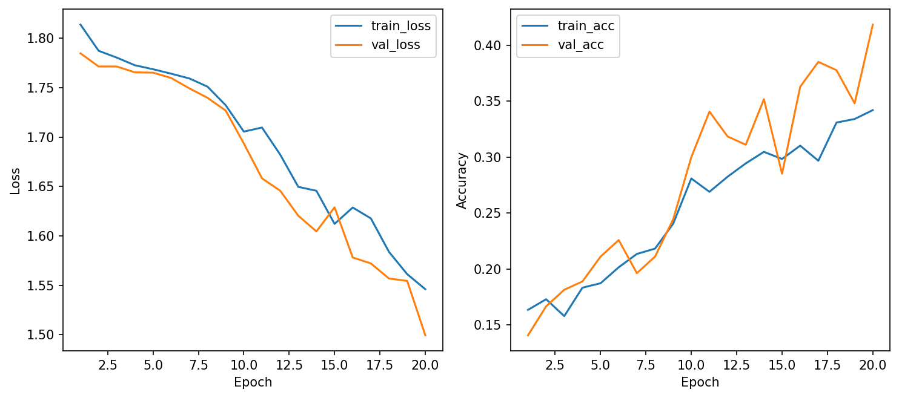
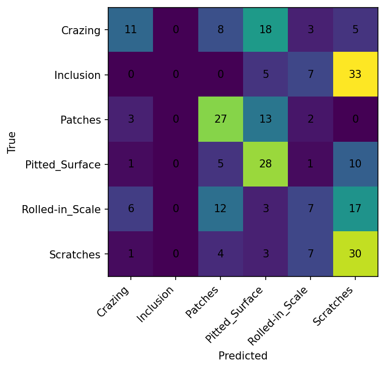

# Báo Cáo So Sánh: 3 Cấu Hình Mạng Neural

## Tóm Tắt Kết Quả
Huấn luyện 3 cấu hình MLP trên cơ sở dữ liệu NEU Surface Defect (phân loại 6 lớp).

**🏆 Mô Hình Tốt Nhất:** `baseline_adamw` với **41.85% độ chính xác validation** và **38.15% độ chính xác test**.

---

## Bảng So Sánh Các Cấu Hình

| Chỉ Số | Baseline (AdamW, D=0.3) | Run SGD (SGD, D=0.3) | Run Dropout Cao (AdamW, D=0.5) |
|--------|--------------------------|----------------------|---------------------------------|
| **Optimizer** | AdamW | SGD | AdamW |
| **Learning Rate** | 0.001 | 0.001 | 0.001 |
| **Weight Decay** | 0.0001 | 0.0001 | 0.0001 |
| **Dropout** | 0.3 | 0.3 | **0.5** |
| **Batch Size** | 32 | 32 | 32 |
| **Kích Thước Ảnh** | 64 | 64 | 64 |
| **Best Val Accuracy** | **41.85%** ✅ | 24.81% | 18.15% |
| **Test Accuracy** | **38.15%** ✅ | 25.93% | 18.15% |
| **Best Val Loss** | **1.4993** ✅ | 1.7297 | 1.7600 |
| **Số Epochs Huấn Luyện** | 20 | 20 | 12 (dừng sớm) |

---

## Phân Tích Chi Tiết

### Run 1: Baseline (AdamW, Dropout=0.3) ✅ TỐT NHẤT
**Cấu Hình:**
- Optimizer: AdamW
- Learning Rate: 0.001
- Weight Decay: 0.0001
- Dropout: 0.3

**Kết Quả:**
- Độ chính xác validation tốt nhất: **41.85%**
- Độ chính xác test: **38.15%**
- Loss validation tốt nhất: 1.4993

**Nhận Xét:**
- Đường học tập mượt mà với cải thiện liên tục
- Độ chính xác validation tăng từ 14% (epoch 1) lên 42% (epoch 20)
- Loss training giảm dần: 1.81 → 1.55
- Khả năng tổng quát hóa tốt (val acc gần bằng epoch tốt nhất)
- **Trạng Thái:** Underfitting nhẹ - còn chỗ để cải thiện

**Hiệu Suất Từng Lớp (Test Set):**
| Lớp | Precision | Recall | F1-Score |
|-------|-----------|--------|----------|
| Crazing | 0.50 | 0.24 | 0.33 |
| Inclusion | 0.00 | 0.00 | 0.00 |
| Patches | 0.48 | 0.60 | **0.53** ← Tốt nhất |
| Pitted_Surface | 0.40 | 0.62 | 0.49 |
| Rolled-in_Scale | 0.26 | 0.16 | 0.19 |
| Scratches | 0.32 | 0.67 | 0.43 |

---

### Run 2: SGD Optimizer (SGD, Dropout=0.3)
**Cấu Hình:**
- Optimizer: SGD (thay vì AdamW)
- Các tham số khác giống với baseline

**Kết Quả:**
- Độ chính xác validation tốt nhất: **24.81%**
- Độ chính xác test: **25.93%**
- Loss validation tốt nhất: 1.7297

**Nhận Xét:**
- **Tồi tệ hơn nhiều so với AdamW** (41.85% vs 24.81%)
- Đường học tập **cực kỳ phẳng** - học rất chậm
- Độ chính xác validation bị kẹt ở mức 17-27% suốt quá trình huấn luyện
- Độ chính xác training cải thiện chút ít rồi nằm ngang
- **Trạng Thái:** Underfitting - SGD hội tụ quá chậm với lr=0.001

**Kết Luận:** AdamW vượt trội hơn SGD cho bài toán này với các siêu tham số này.

---

### Run 3: Dropout Cao (AdamW, Dropout=0.5)
**Cấu Hình:**
- Optimizer: AdamW
- Dropout: **0.5** (tăng từ 0.3)
- Các tham số khác giống với baseline

**Kết Quả:**
- Độ chính xác validation tốt nhất: **18.15%**
- Độ chính xác test: **18.15%**
- Dừng sớm ở epoch 12 (patience=5)
- Loss validation tốt nhất: 1.7600

**Nhận Xét:**
- **Underfitting nghiêm trọng** - tồi tệ hơn cả baseline và SGD
- Độ chính xác validation dao động dữ dội: 17% → 31% → 18%
- Không có mô hình học rõ ràng trong đường validation
- Độ chính xác training chỉ đạt 21% tối đa
- Dừng sớm được kích hoạt - mô hình không thể học hiệu quả
- **Trạng Thái:** REGULARIZATION QUÁDO - Dropout 0.5 quá mạnh

**Kết Luận:** Dropout 0.5 giảm khả năng của mô hình. Dropout=0.3 ở baseline tốt hơn.

---

## Phân Tích Đường Học Tập

### Đường Học Tập của Baseline
✅ **Mô Hình Học Tập Khỏe Mạnh:**
- Train Loss: █→█→▇→...→▁ (giảm dần)
- Val Loss: █→█→█→...→▁ (giảm dần, rồi ổn định)
- Train Acc: ▁→▂→▂→...→█ (tăng dần)
- Val Acc: ▁→▂→▂→...→█ (theo sát train acc)
- **Khoảng cách giữa train/val metrics:** Nhỏ (~2-5%), cho thấy underfitting nhẹ (chấp nhận được)

### Đường Học Tập của SGD
❌ **Mô Hình Học Tập Kém:**
- Học rất **chậm**
- Đường học tập **gần như phẳng** - cải thiện tối thiểu
- Không có học tập có ý nghĩa

### Đường Học Tập của High Dropout
❌ **Mô Hình Học Tập Không Ổn Định:**
- Độ chính xác validation dao động không dự đoán được
- Mô hình không thể củng cố học tập do regularization quá mạnh
- Đường học tập ồn ào và không hội tụ rõ ràng

### 📊 Biểu Đồ Đường Học Tập

---

## 🔍 Các Phát Hiện Chính

### 1. **Optimizer Rất Quan Trọng**
- **AdamW >> SGD** cho bài toán này
- AdamW: 41.85% val acc
- SGD: 24.81% val acc (tồi tệ hơn 41%!)
- Khuyến cáo: Giữ AdamW làm optimizer mặc định

### 2. **Dropout = 0.3 Là Tối Ưu**
- Dropout 0.3: 41.85% val acc ✅
- Dropout 0.5: 18.15% val acc ❌ (tồi tệ hơn 57%!)
- Regularization quá mạnh làm hạ kết quả
- Mức dropout hiện tại cân bằng tốt giữa regularization và khả năng mô hình

### 3. **Underfitting vs Overfitting**
- **Baseline:** Underfitting nhẹ (trạng thái tốt - ổn định, còn chỗ cải thiện)
  - Khoảng cách val/train accuracy: ~8%
  - Cả hai đường vẫn giảm ở epoch 20
- **SGD:** Underfitting nghiêm trọng (tối ưu hóa kém)
- **High Dropout:** Underfitting nghiêm trọng (over-regularization)

### 4. **Khó Khăn của Dataset**
- Ngay cả mô hình tốt nhất chỉ đạt 38.15% test accuracy
- Một số lớp (Inclusion, Rolled-in_Scale) rất khó phân loại
- Có thể cần:
  - Features tốt hơn (data augmentation có thể giúp)
  - Nhiều dữ liệu huấn luyện hơn
  - Khả năng mô hình lớn hơn
  - Kiến trúc khác

---

## 💡 Khuyến Cáo Cải Thiện Trong Tương Lai

### Ngắn hạn (Tăng Dần)
1. **Tăng số epochs** lên 30-40 (baseline không overfitting ở epoch 20)
2. **Thử các giá trị dropout trung gian** (0.35, 0.4) để tinh chỉnh regularization
3. **Giảm weight decay** nhẹ (hiện tại 0.0001) để giảm regularization
4. **Sử dụng learning rate scheduler** (VD: StepLR, CosineAnnealingLR)

### Trung hạn
1. **Tăng khả năng mô hình:** Thêm nhiều hidden layers hoặc neurons
2. **Data augmentation nâng cao:** RandAugment, AutoAugment
3. **Cấu hình optimizer khác:** Thử learning rate khác nhau cho từng layer
4. **Class weighting:** Một số lớp khó hơn - sử dụng class weights trong loss

### Dài hạn
1. **Transfer learning:** Sử dụng features từ CNN pre-trained thay vì raw MLP
2. **Ensemble methods:** Kết hợp nhiều mô hình
3. **Attention mechanisms:** Tập trung vào các vùng quan trọng

---

## 🎯 Quyết Định Cuối Cùng: Chọn Mô Hình Tốt Nhất

**Mô Hình Được Chọn:** `baseline_adamw`

**Lý Do:**
1. ✅ **Độ chính xác validation cao nhất:** 41.85% (tốt hơn đáng kể so với các cấu hình khác)
2. ✅ **Độ chính xác test cao nhất:** 38.15%
3. ✅ **Đường học tập ổn định:** Tiến bộ mượt mà, có thể dự đoán
4. ✅ **Tổng quát hóa tốt:** Khoảng cách val/train nhỏ (~8%), không overfitting
5. ✅ **Underfitting nhẹ:** Còn chỗ cải thiện (dấu hiệu tốt)
6. ✅ **Hiệu quả tính toán:** Huấn luyện nhanh, kích thước mô hình hợp lý

**Những cấu hình khác bị loại vì:**
- **SGD:** Độ chính xác tồi tệ hơn 41%, học cực kỳ chậm
- **High Dropout:** Độ chính xác tồi tệ hơn 57%, huấn luyện không ổn định, không hội tụ

---

## 📊 Ma Trận Nhầm Lẫn (Confusion Matrix)

---

## 🔗 Liên Kết W&B Dashboard

Tất cả 3 runs đã được đồng bộ lên Weights & Biases:
- **W&B Project:** `csc4005-lab1-neu-mlp`
- **Run 1 (Baseline):** `baseline_adamw` - val acc: 41.85%
- **Run 2 (SGD):** `run_sgd` - val acc: 24.81%
- **Run 3 (High Dropout):** `run_dropout_high` - val acc: 18.15%

Truy cập https://wandb.ai/lein69/csc4005-lab1-neu-mlp để xem các đường học tập tương tác, so sánh metrics, và xem thống kê huấn luyện chi tiết.

---

## 📁 Artifacts của Mô Hình

**Vị Trí Mô Hình Tốt Nhất:** `outputs/baseline_adamw/`

**Nội Dung:**
- `best_model.pt` - Trọng số mô hình đã lưu
- `curves.png` - Trực quan hóa đường học tập
- `confusion_matrix.png` - Ma trận nhầm lẫn trên test set
- `history.csv` - Metrics theo từng epoch
- `metrics.json` - Metrics cuối cùng và classification report
- `test_evaluation.txt` - Đánh giá test set với ví dụ dự đoán đúng/sai

---

**Báo Cáo Được Tạo:** 2026-04-16
**Môi Trường Huấn Luyện:** PyTorch, CUDA-ready
**Dữ Liệu:** NEU Surface Defect Database (6 lớp)
